## Tasks
- [Overview](#Overview)
- [Create the Resource Reader and Operator Custom Role](#Create-the-Resource-Reader-and-Operator-Custom-Role)
- [Deploy BudgetDeallocator Logic App](#Deploy-BudgetDeallocator-Logic-App)
- [Deploy BudgetDeallocatorOrchestrator Logic App](#Deploy-BudgetDeallocatorOrchestrator-Logic-App)
- [Create an Azure Cost Management Budget & Alert](#Create-an-Azure-Cost-Management-Budget-and-Alert)

---

# Overview


Budget Deallocator's intent is to protect budgets from crossing over a specified threshold. This is done by taking action to deallocate Azure resources upon being triggered by an Azure Cost Management Budget Alert trigger. 

Generally, a resource which is in the deallocated, paused, shutdown, or similar state in Azure no longer incurs compute charges; however, it is important to understand that not all resources in Azure are eligible to be deallocated, and that other charges for the resources, such as storage, will still incur charges. 

Today, the following resource types are deallocated by Budget Deallocator: 
- Azure Virtual Machines
- Azure Synapse Analytics Dedicated Pools
- Azure Kubernetes Service Clusters

Budget Deallocator has been split into two separate Logic Apps so that an ITSM, workflow manager, or similar may be placed in between to handle additional logic such as an approval workflow.

The first Logic App, **BudgetDeallocatorOrchestrator**, is what is triggered by the Azure Cost Management Budget alert. Its logic is as follows: 


The second Logic App, **BudgetDeallocator**, is triggered by **BudgetDeallocatorOrchestrator** and does the actual work of identifying active resources that are candidates to be deallocated and changing their state so they no longer incur compute charges. Its logic is as follows:


---

# Create the Resource Reader and Operator Custom Role
We will need to create a [custom Azure Role Based Access Control Role](https://docs.microsoft.com/en-us/azure/role-based-access-control/custom-roles) so that the BudgetDeallocator Logic App's [System Assigned Managed Identity](https://docs.microsoft.com/en-us/azure/active-directory/managed-identities-azure-resources/overview) is able to take action on Azure resources on our behalf. This custom role will [clone the Reader role](https://docs.microsoft.com/en-us/azure/role-based-access-control/built-in-roles#reader) so that we may enumerate all resources. We will then extend the role to allow it take the following actions: 

- [Microsoft.Compute/virtualMachines/start/action](https://docs.microsoft.com/en-us/azure/role-based-access-control/resource-provider-operations#microsoftcompute)
- [Microsoft.Compute/virtualMachines/restart/action](https://docs.microsoft.com/en-us/azure/role-based-access-control/resource-provider-operations#microsoftcompute)
- [Microsoft.Compute/virtualMachines/deallocate/action](https://docs.microsoft.com/en-us/azure/role-based-access-control/resource-provider-operations#microsoftcompute)
- [Microsoft.Synapse/workspaces/sqlPools/pause/action](https://docs.microsoft.com/en-us/azure/role-based-access-control/resource-provider-operations#microsoftsynapse)
- [Microsoft.Synapse/workspaces/sqlPools/resume/action](https://docs.microsoft.com/en-us/azure/role-based-access-control/resource-provider-operations#microsoftsynapse)
- [Microsoft.ContainerService/managedClusters/stop/action](https://docs.microsoft.com/en-us/azure/role-based-access-control/resource-provider-operations#microsoftcontainerservice)
- [Microsoft.ContainerService/managedClusters/start/action](https://docs.microsoft.com/en-us/azure/role-based-access-control/resource-provider-operations#microsoftcontainerservice)

1. From your Azure subscription, click **Access Control (IAM)**, then click **Roles.** Finally, locate the *Reader* role, click on the ellipsis on the far right and select **clone**.

    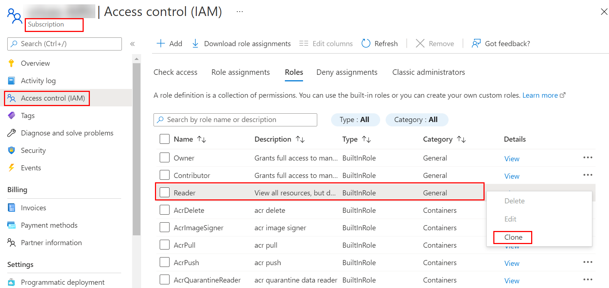
    
1. In the *Basics* tab, enter **Resource Reader and Operator** for the *Custom role name* and leave everything else as default. 
1. In the *JSON* tab, click **Edit**, and add the following after the *"\*/read",* line , then click **Save**, then **Review + Create** followed by **Create**.
    ```
    "Microsoft.Compute/virtualMachines/start/action",
    "Microsoft.Compute/virtualMachines/restart/action",
    "Microsoft.Compute/virtualMachines/deallocate/action",
    "Microsoft.Synapse/workspaces/sqlPools/pause/action",
    "Microsoft.Synapse/workspaces/sqlPools/resume/action",
    "Microsoft.ContainerService/managedClusters/stop/action",
    "Microsoft.ContainerService/managedClusters/start/action"
    ```
    
    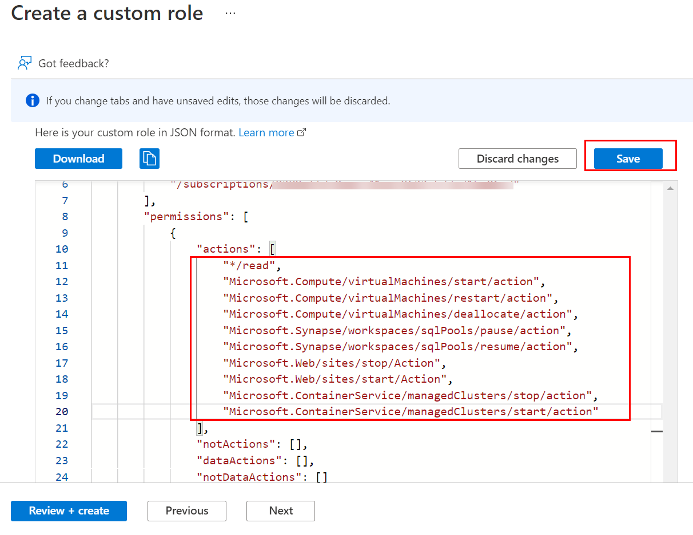

**Note: Please ensure you add a comma after "\*read"**

---


# Deploy BudgetDeallocator Logic App

1. From the Azure Portal, click on the **+Create a resource** icon on the top of the far-left navigation blade, search for *Logic App* and select **Logic App** from the results. 
  
    
    
1. Fill out the **Basics** form with the appropriate information following the guidance below: 

    | Field Name  | Recommended Value |
    | ------------- | ------------- |
    | Subscritpion  | A centrally managed or "hub" Azure Subscription  |
    | Resource Group  | budgetDeallocator-RG  |
    | Type  | Consumption  |
    | Logic App Name  | budgetDeallocator  |
  
1. Leave all other fields as default, click **Review+Create** and upon validation, click the **Create** button. 

1. From your new Logic App's resource page, click **Identity**, then toggle the *System Assigned Managed Identity* to **On** and click **Save.**
 
     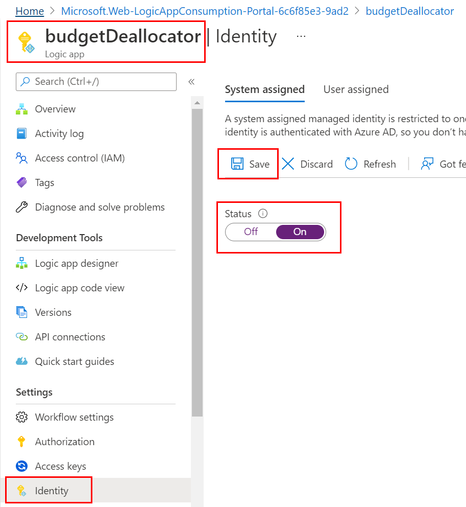
     
 1. Click **Azure Role Assignments**

 1. Next, click **+ Add role assignment**, select **Subscription** as *Scope*, the appropriate subscription as *Subscription*. Select the custom role created earlier, **Resource Reader and Operator** as *Role.* Then click **Save.**
    >This will allow the Logic App to enumerate resources in your environment.

     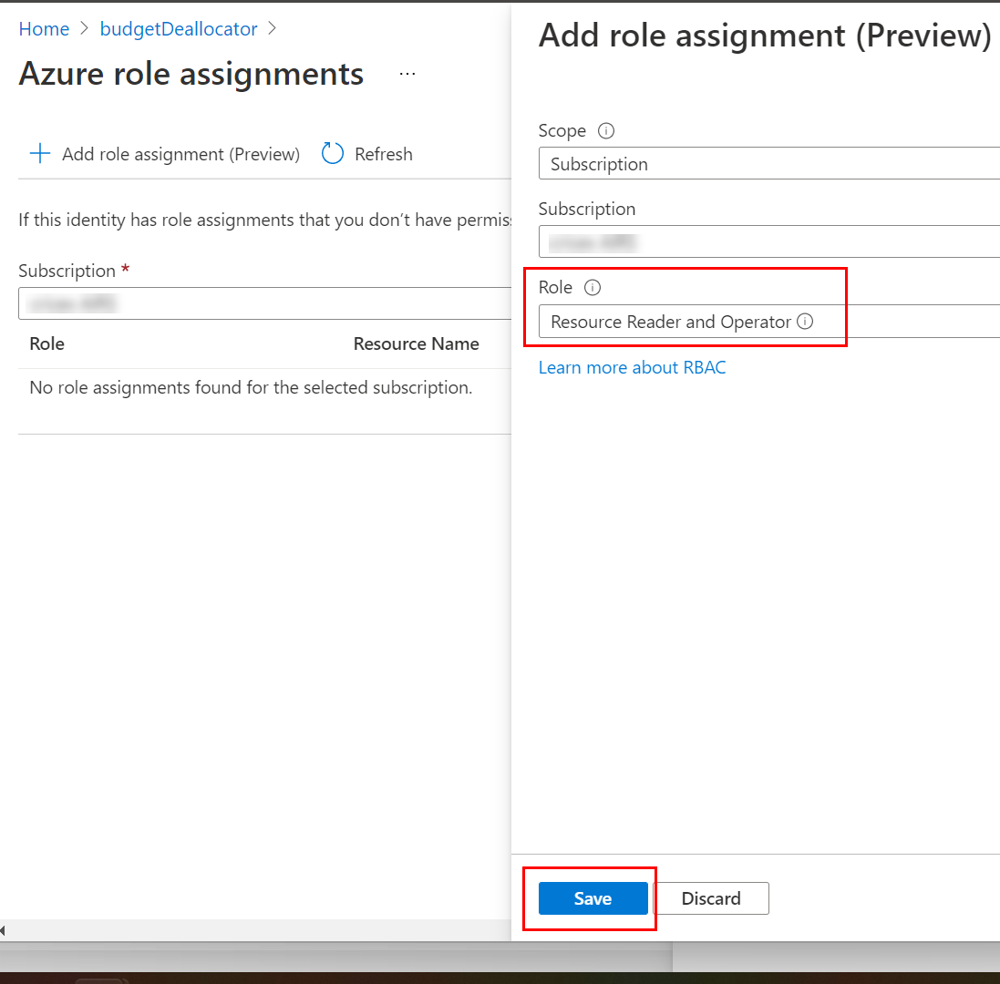

 1. Click **Logic App Code View** from the left-heand navigation blade. Next, select all & delete the default code that is presented on the right-hand side. Once deleted, paste in the JSON contents of the [budgetDeallocator Logic App found here](https://raw.githubusercontent.com/microsoft/STRIDES/main/budgetDeallocator/budgetDeallocator.json) and press the **Save** icon.

     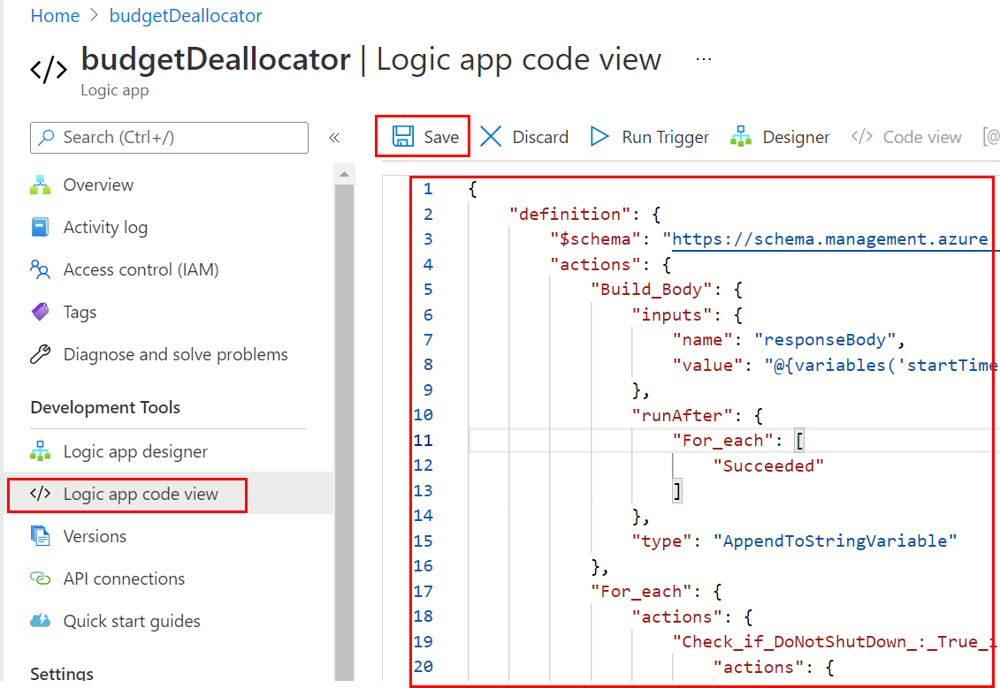

---

# Deploy BudgetDeallocatorOrchestrator Logic App

1. From the Azure Portal, click on the **+Create a resource** icon on the top of the far-left navigation blade, search for *Logic App* and select **Logic App** from the results. 
  
    
    
1. Fill out the **Basics** form with the appropriate information following the guidance below: 

    | Field Name  | Recommended Value |
    | ------------- | ------------- |
    | Subscritpion  | A centrally managed or "hub" Azure Subscription  |
    | Resource Group  | budgetDeallocator-RG  |
    | Type  | Consumption  |
    | Logic App Name  | budgetDeallocatorOrchestrator  |
  
1. Leave all other fields as default, click **Review+Create** and upon validation, click the **Create** button. 

    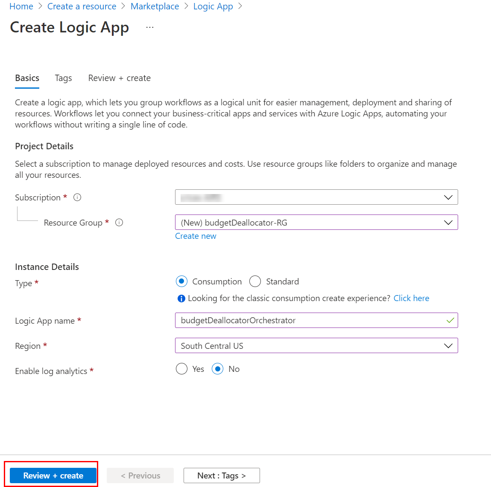
    
 1. From your new Logic App's resource page, click **Identity**, then toggle the *System Assigned Managed Identity* to **On** and click **Save.**
 
     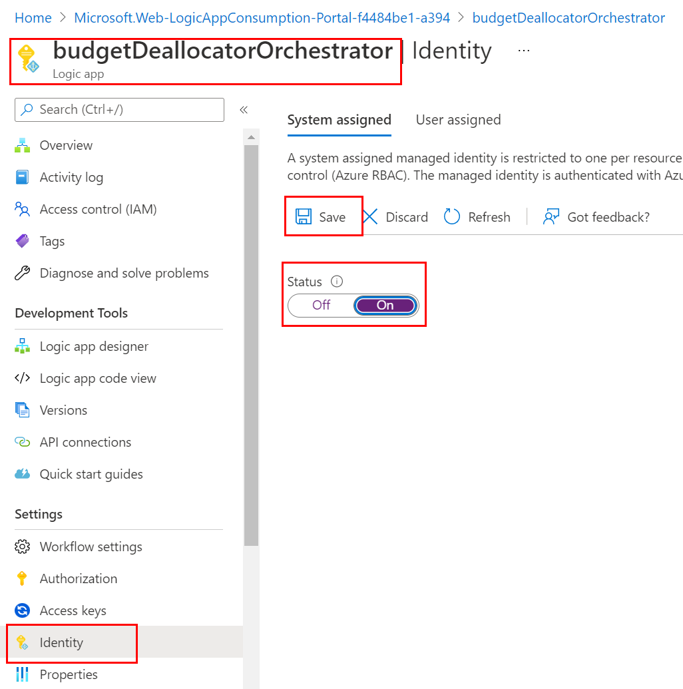
     
 1. Click **Azure Role Assignments**

 1. Next, click **+ Add role assignment**, select **Subscription** as *Scope*, the appropriate subscription as *Subscription*, and **Reader** as *Role.* Then click **Save.**
    >This will allow the Logic App to enumerate resources in your environment.

     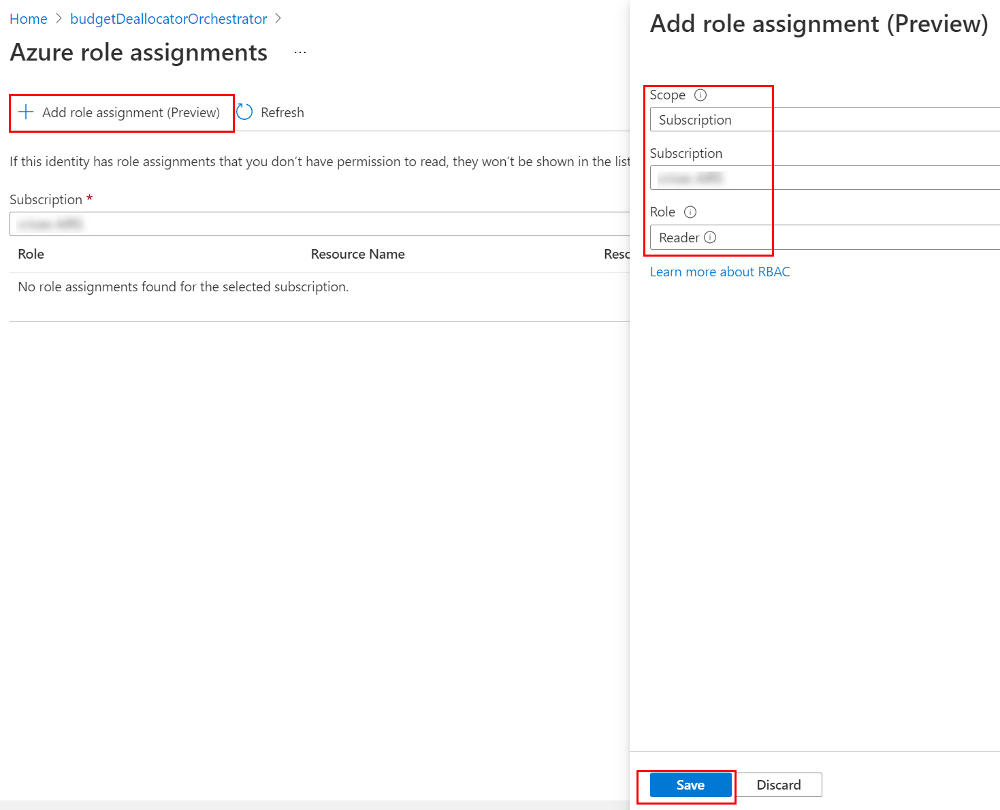
     
 1. Click **Logic App Code View** from the left-heand navigation blade. Next, select all & delete the default code that is presented on the right-hand side. Once deleted, paste in the JSON contents of the [budgetDeallocatorOrchestrator Logic App found here](https://raw.githubusercontent.com/microsoft/STRIDES/main/budgetDeallocator/budgetDeallocatorOrchestrator.json) and press the **Designer** icon.

     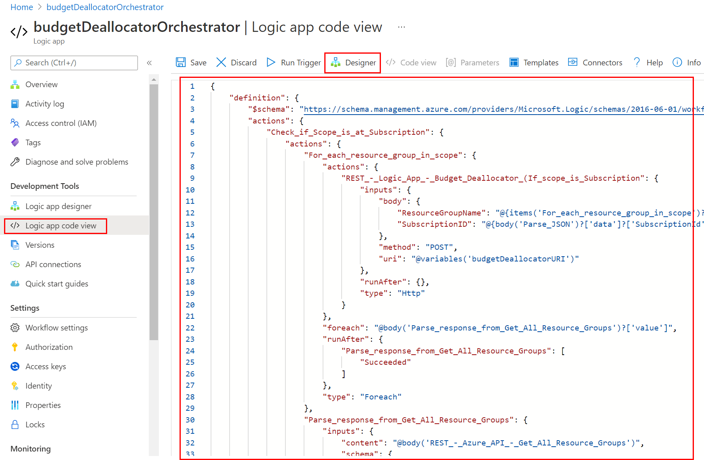
     
 1. Expand the **Define budgetDeallocatorURI** by clicking on its title and replace the **Value** with the URI for your budgetDeallocator Logic App and click **Save.**
    >Optionally, you can instead replace the value with another API endpoint such as an ITSM solution or other Logic App to extend functionality. 

     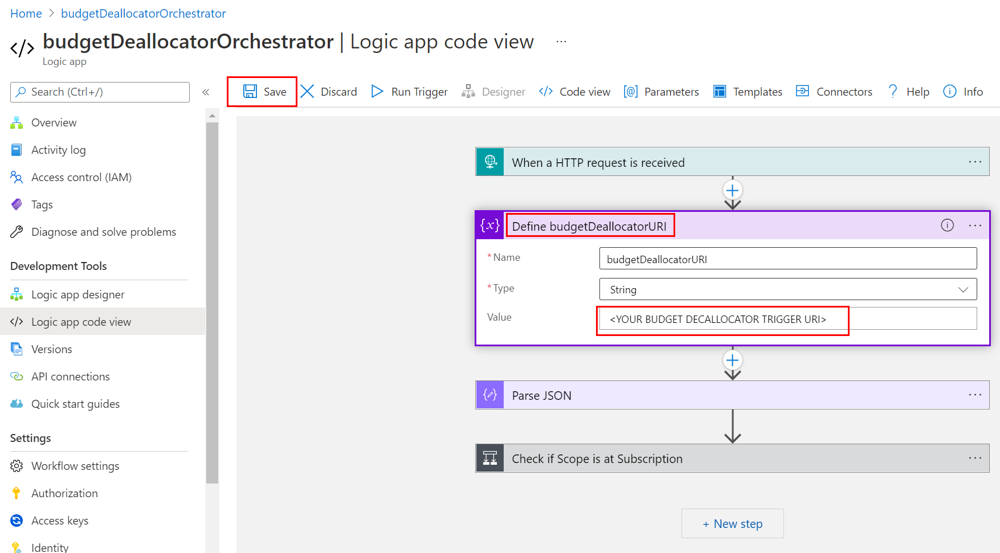

---

# Create an Azure Cost Management Budget and Alert
Within [Azure Cost Management + Billing](https://docs.microsoft.com/en-us/azure/cost-management-billing/cost-management-billing-overview_, we are able to define [Azure Budgets](https://docs.microsoft.com/en-us/azure/cost-management-billing/costs/tutorial-acm-create-budgets) at specifics scopes, such as an Enrollment, Management Group, Subscription, and Resource Group. Within these budgets, we are also able to set thresholds (e.g. 75% of budget) for alerting. Within each threshold, we are able to send notifications as well as trigger [Azure Action Groups](https://docs.microsoft.com/en-us/azure/azure-monitor/alerts/action-groups). Azure Action Groups allow you to do a multitude of things, such as trigger an ITSM solution or REST API; however, we will be focusing on triggering our budgetDeallocatorOrchestrator Logic App.

1. From the Azure Portal, select the **Cost Management + Billing** icon from the far-left navigation pane. Next, click **Cost Management**, followed by **Budgets.** Finally, set your scope to the appropriate scope you would like to protect against budget overuns. This can be set to an Enrollment, Management Group, Subscription or Resource Group.

     
     
1. From the *Create budget* page, give your budget an appropriate *Name*, *Reset period* and *Amount*. If appropriate, set the *Creation date* to today's date, then click **Next.**

    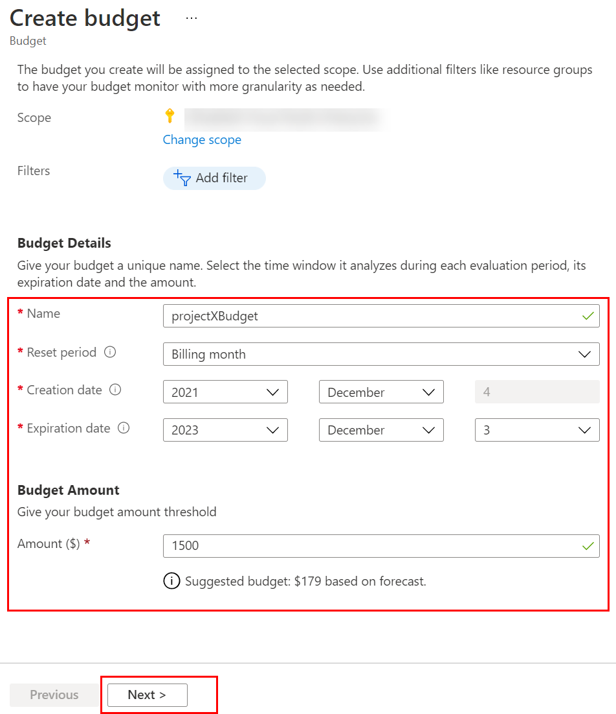

1. Use the following table as *guidance* for the **Alert conditions** section. 

    | Field Name  | Recommended Value | Note |
    | ------------- | ------------- | ------------- |
    | Type  | Actual  | Triggered when the budget actually reaches this threshold instead of when it is forecasted to reach it  |
    | % of budget  | 90  | Trigger when the budget actually reaches 90%  |

1. Under **Alert recipients (email)** enter in the email address for who should receive a notification, next click **Manage action group.**

    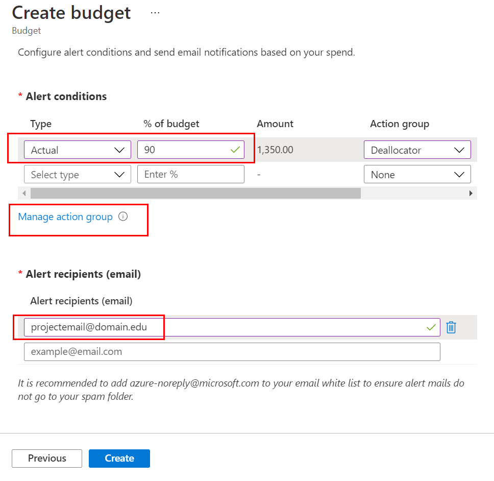
    
1. From the Action Groups page, click **+Create New**. Fill out the approrpiate details in the *Basics* tab and then go to the *Actions* tab.

    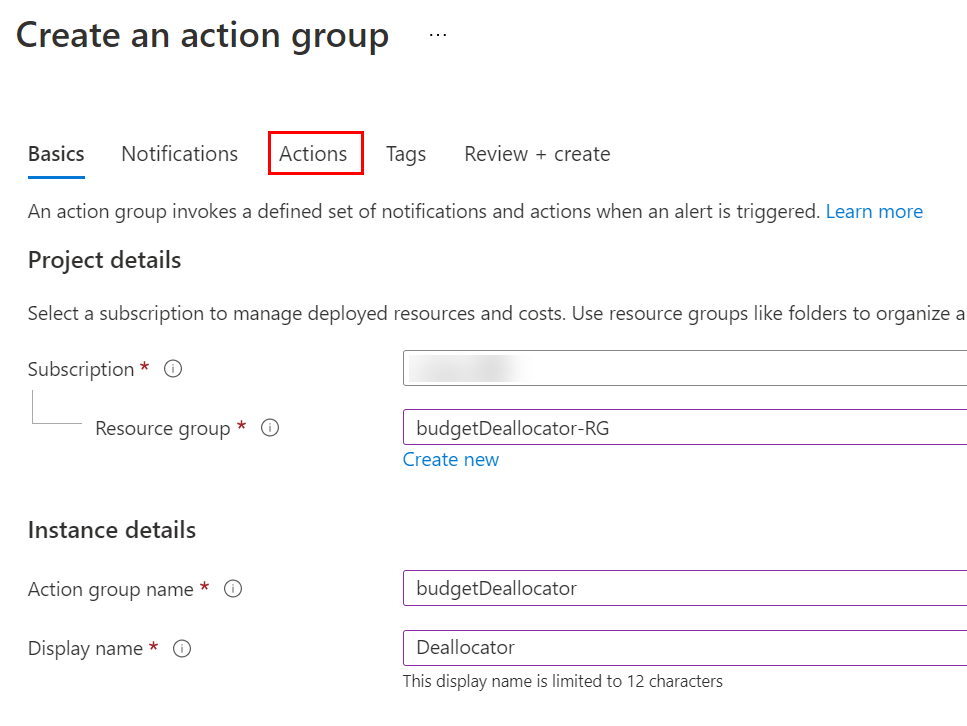
 
1. From the *Actions* tab, choose **Logic App** for *Action type*, then select your **budgetDeallocatorOrchestrator** Logic App and click OK. **DO NOT enable the Common Alert Schema.** Next, give your action and appropriate name and click **Review + Create**, followed by **Create.**

    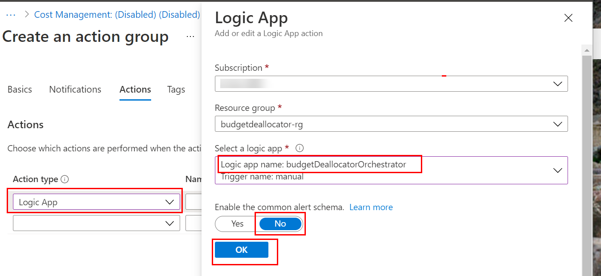
    
1. Close the *Manage action group* window, which will take you back to the *Create budget* page. You will now be able to choose your new action group as an option from within the *Action Group* drop down, then press **Create**.

    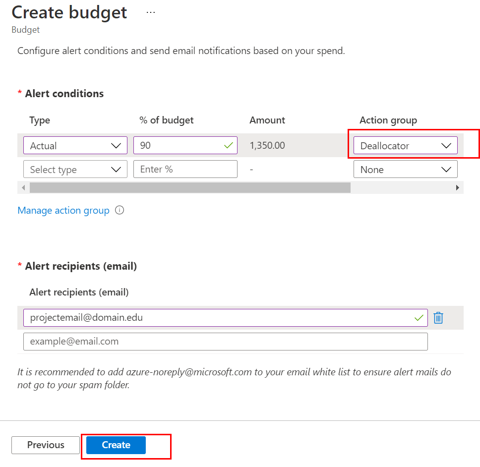
    
# Congratulations!
You should now have a Budget Alert trigger that triggers the budgetDeallocatorOrchestrator Logic App that subsequently triggers the budgetDeallocator Logic App to deallocate compute resources in Azure!

For a detailed overview of the solution, please go to the [Overview](#Overview) at the top of the page. 
