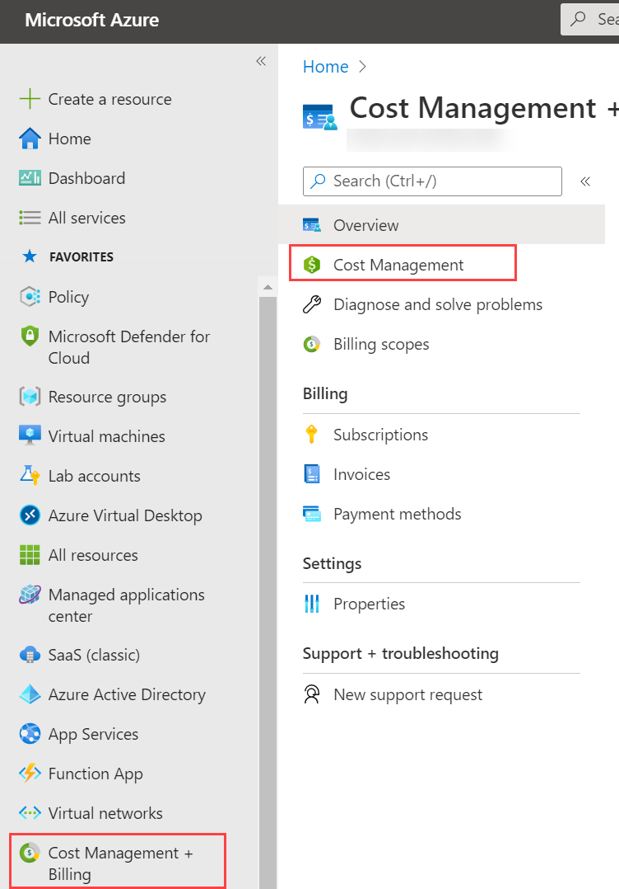

# Overview
All extramural NIH STRIDES environments are required to report their utilization and cost to NIH monthly so that NIH may audit discounts and report to congress. This document provides instructions on automating the reporting to ensure your NIH STRIDES environment remains compliant. 

## Prerequisites:

- [All STRIDES Azure Subscriptions must be isolated within their own Management Group](#STRIDES-Management-Group)
- [An administrative Azure subscription within the NIH Management Group](#STRIDES-Administrative-Subscription)

- [Required resources to request from NIH](#Required-resources-from-NIH):
  - Reporting Storage Account name
  - Reporting Storage Account container name
  - Reporting Storage Account SAS token

## Tasks:

1. [Create an Azure Cost Management Export](#Create-a-Cost-Management-Export)
1. [Create Logic App to Push Data to NIH](#Create-Logic-App-to-Push-Data-to-NIH)

# STRIDES Management Group

A [Management Group]( https://docs.microsoft.com/en-us/azure/governance/management-groups/overview) isolating STRIDES workloads from all other institutional workloads is required so that STRIDES workloads do not co-mingle with unrelated workloads. This will enforce an isolation of cost, policy, permissions, and reduce complexity for reporting and maintenance.

Below is an example of a potential management group hierarchy. Your management group hierarchy does not need to align exactly with the example, its intent is merely to illustrate the separation of all STRIDES-related workloads within the STRIDES enrollment into its own Management Group:

Creating a management group is a simple and well documented process:
- [What are Azure management groups?]( https://docs.microsoft.com/en-us/azure/governance/management-groups/overview)
- [Quickstart: Create a Management Group]( https://docs.microsoft.com/en-us/azure/governance/management-groups/create-management-group-portal)

# STRIDES Administrative Subscription

A single administrative subscription within your STRIDES enrollment & management group is required in order to host the resources and logic to report cost and utilizations to NIH.

> **_Note:_**  Like all STRIDES subscriptions, you must first seek NIH approval by filling out the [Subscription Provisionoing Form](../subscription%20provisioning/README.md).

Once you have received approval from NIH, creating the administrative subscription is no different than creating any other Azure subscription. Documentation on creating a new EA subscription [can be found here](https://docs.microsoft.com/en-us/azure/cost-management-billing/manage/create-subscription). 

Requirements for the Administrative Subscription:
- Must reside within your NIH enrollment
- Must reside within your NIH Management Group
 
> **_Note:_** Since all EA subscriptions default to the same name ("Microsoft Azure Enterprise") it is strongly recommended that you immediately change the name to something unique and meaningful (e.g. "STRIDES - Admin")

# Required resources from NIH

An NIH-owned Azure Storage Account name, storage container name, and secure access signature (SAS) token are required to export data from within your institution's Azure environment to NIH's Azure environment.

> **_Note:_** NIH is currently implementing the solution for this process and are currently not able to take requests. This document will be updated once the processes are in place. For the time being, you may proceed with the rest of the documentation to request your Azure subscription and generate the cost and utilization exports. Once the processes are in place at NIH, you **must complete the steps to send data to their environment on a monthly basis.** 

# Create a Cost Management Export

Azure Cost Management provides the ability to automatically schedule an export of your STRIDES environment's cost and utilization into an Azure Storage Account within your STRIDES Adminsitrative Subscription.

1. From the Azure Portal, click on **Cost Management + Billing**, then **Cost Management**.

    

1. Ensure your scope is set to your STRIDES Management group. If not, click **Change** next to your current scope, drill down until you see your STRIDES management group and select it. 

    

1. Click on **Exports** from the middle blade and follow the detailed instructions in the following link with these parameters.

    Link: **[Tutorial: Create and manage exported data](https://docs.microsoft.com/en-us/azure/cost-management-billing/costs/tutorial-export-acm-data?tabs=azure-portal)**

    | Field Name  | Recommended Value |
    | ------------- | ------------- |
    | **Name**  | STRIDESMonthly  |
    | **Export Type**  | Monthly export of last month's cost  |
    | **Start Date**  | Default  |
    | **Storage**  | Create new  |
    | **Subscription**  | Your STRIDES Adminsitrative Subscription  |
    | **Resource group**  | Create new Resource Group called "STRIDES-exports-rg"  |
    | **Account Name**  | Globally unique and meaningful alphanumeric name  |
    | **Location**  | Azure Region closest to your institution  |
    | **Container**  | strides  |
    | **Directory**  | monthly  |

    

# Create Logic App to Push Data to NIH

Please see note here: [Required resources to request from NIH](#Required-resources-from-NIH)